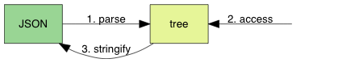
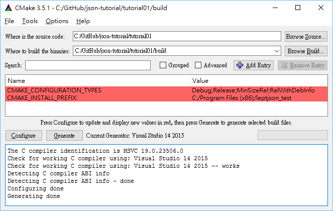

# 从零开始的 JSON 库教程（一）：启程

* Milo Yip
* 2016/9/15

本文是[《从零开始的 JSON 库教程》](https://zhuanlan.zhihu.com/json-tutorial)的第一个单元。教程练习源代码位于 [json-tutorial](https://github.com/miloyip/json-tutorial)。

本单元内容：

1. [JSON 是什么](#json-是什么)
2. [搭建编译环境](#搭建编译环境)
3. [头文件与 API 设计](#头文件与-api-设计)
4. [JSON 语法子集](#json-语法子集)
5. [单元测试](#单元测试)
6. [宏的编写技巧](#宏的编写技巧)
7. [实现解析器](#实现解析器)
8. [关于断言](#关于断言)
9. [总结与练习](#总结与练习)
10. [常见问答](#常见问答)

## JSON 是什么

JSON（JavaScript Object Notation）是一个用于数据交换的文本格式，现时的标准为[ECMA-404](http://www.ecma-international.org/publications/files/ECMA-ST/ECMA-404.pdf)。

虽然 JSON 源至于 JavaScript 语言，但它只是一种数据格式，可用于任何编程语言。现时具类似功能的格式有 XML、YAML，当中以 JSON 的语法最为简单。

例如，一个动态网页想从服务器获得数据时，服务器从数据库查找数据，然后把数据转换成 JSON 文本格式：

~~~js
{
    "title": "Design Patterns",
    "subtitle": "Elements of Reusable Object-Oriented Software",
    "author": [
        "Erich Gamma",
        "Richard Helm",
        "Ralph Johnson",
        "John Vlissides"
    ],
    "year": 2009,
    "weight": 1.8,
    "hardcover": true,
    "publisher": {
        "Company": "Pearson Education",
        "Country": "India"
    },
    "website": null
}
~~~

网页的脚本代码就可以把此 JSON 文本解析为内部的数据结构去使用。

从此例子可看出，JSON 是树状结构，而 JSON 只包含 6 种数据类型：

* null: 表示为 null
* boolean: 表示为 true 或 false
* number: 一般的浮点数表示方式，在下一单元详细说明
* string: 表示为 "..."
* array: 表示为 [ ... ]
* object: 表示为 { ... }

我们要实现的 JSON 库，主要是完成 3 个需求：

1. 把 JSON 文本解析为一个树状数据结构（parse）。
2. 提供接口访问该数据结构（access）。
3. 把数据结构转换成 JSON 文本（stringify）。

我们会逐步实现这些需求。在本单元中，我们只实现最简单的 null 和 boolean 解析。

## 搭建编译环境

我们要做的库是跨平台、跨编译器的，同学可使用任意平台进行练习。

练习源代码位于 [json-tutorial](https://github.com/miloyip/json-tutorial)，当中 tutorial01 为本单元的练习代码。建议同学登记为 GitHub 用户，把项目 fork 一个自己的版本，然后在上面进行修改。不了解版本管理的同学，也可以按右方「Clone or download」按钮，简单下载一个 zip 文件。

我们的 JSON 库名为 leptjson，代码文件只有 3 个：

1. `leptjson.h`：leptjson 的头文件（header file），含有对外的类型和 API 函数声明。
2. `leptjson.c`：leptjson 的实现文件（implementation file），含有内部的类型声明和函数实现。此文件会编译成库。
3. `test.c`：我们使用测试驱动开发（test driven development, TDD）。此文件包含测试程序，需要链接 leptjson 库。

为了方便跨平台开发，我们会使用一个现时最流行的软件配置工具 [CMake](https://cmake.org/)。

在 Windows 下，下载安装 CMake 后，可以使用其 cmake-gui 程序：

先在 "Where is the source code" 选择 json-tutorial/tutorial01，再在 "Where to build the binary" 键入上一个目录加上 /build。

按 Configure，选择编译器，然后按 Generate 便会生成 Visual Studio 的 .sln 和 .vcproj 等文件。注意这个 build 目录都是生成的文件，可以随时删除，也不用上传至仓库。

在 OS X 下，建议安装 [Homebrew](http://brew.sh/)，然后在命令行键入：

~~~
$ brew install cmake
$ cd github/json-tutorial/tutorial01
$ mkdir build
$ cd build
$ cmake -DCMAKE_BUILD_TYPE=Debug ..
$ make
~~~

这样会使用 GNU make 来生成项目，把 Debug 改成 Release 就会生成 Release 配置的 makefile。

若你喜欢的话，CMake 也可以生成 Xcode 项目：

~~~
$ cmake -G Xcode ..
$ open leptjson_test.xcodeproj
~~~

而在 Ubuntu 下，可使用 `apt-get` 来安装：

~~~
$ apt-get install cmake
~~~

无论使用什么平台及编译环境，编译运行后会出现：

~~~
$ ./leptjson_test
/Users/miloyip/github/json-tutorial/tutorial01/test.c:56: expect: 3 actual: 0
11/12 (91.67%) passed
~~~

若看到类似以上的结果，说明已成功搭建编译环境，我们可以去看看那几个代码文件的内容了。

## 头文件与 API 设计

C 语言有头文件的概念，需要使用 `#include`去引入头文件中的类型声明和函数声明。但由于头文件也可以 `#include` 其他头文件，为避免重复声明，通常会利用宏加入 include 防范（include guard）：

~~~c
#ifndef LEPTJSON_H__
#define LEPTJSON_H__

/* ... */

#endif /* LEPTJSON_H__ */
~~~

宏的名字必须是唯一的，通常习惯以 `_H__` 作为后缀。由于 leptjson 只有一个头文件，可以简单命名为 `LEPTJSON_H__`。如果项目有多个文件或目录结构，可以用 `项目名称_目录_文件名称_H__` 这种命名方式。

如前所述，JSON 中有 6 种数据类型，如果把 true 和 false 当作两个类型就是 7 种，我们为此声明一个枚举类型（enumeration type）：

~~~c
typedef enum { LEPT_NULL, LEPT_FALSE, LEPT_TRUE, LEPT_NUMBER, LEPT_STRING, LEPT_ARRAY, LEPT_OBJECT } lept_type;
~~~

因为 C 语言没有 C++ 的命名空间（namespace）功能，一般会使用项目的简写作为标识符的前缀。通常枚举值用全大写（如 `LEPT_NULL`），而类型及函数则用小写（如 `lept_type`）。

接下来，我们声明 JSON 的数据结构。JSON 是一个树形结构，我们最终需要实现一个树的数据结构，每个节点使用 `lept_value` 结构体表示，我们会称它为一个 JSON 值（JSON value）。
在此单元中，我们只需要实现 null, true 和 false 的解析，因此该结构体只需要存储一个 lept_type。之后的单元会逐步加入其他数据。

~~~c
typedef struct {
    lept_type type;
}lept_value;
~~~

C 语言的结构体是以 `struct X {}` 形式声明的，定义变量时也要写成 `struct X x;`。为方便使用，上面的代码使用了 `typedef`。

然后，我们现在只需要两个 API 函数，一个是解析 JSON：

~~~c
int lept_parse(lept_value* v, const char* json);
~~~

传入的 JSON 文本是一个 C 字符串（空结尾字符串／null-terminated string），由于我们不应该改动这个输入字符串，所以使用 `const char*` 类型。

另一注意点是，传入的根节点指针 v 是由使用方负责分配的，所以一般用法是：

~~~c
lept_value v;
const char json[] = ...;
int ret = lept_parse(&v, json);
~~~

返回值是以下这些枚举值，无错误会返回 `LEPT_PARSE_OK`，其他值在下节解释。

~~~c
enum {
    LEPT_PARSE_OK = 0,
    LEPT_PARSE_EXPECT_VALUE,
    LEPT_PARSE_INVALID_VALUE,
    LEPT_PARSE_ROOT_NOT_SINGULAR
};
~~~

现时我们只需要一个访问结果的函数，就是获取其类型：

~~~c
lept_type lept_get_type(const lept_value* v);
~~~

## JSON 语法子集

下面是此单元的 JSON 语法子集，使用 [RFC7159](http://rfc7159.net/rfc7159) 中的 [ABNF](https://tools.ietf.org/html/rfc5234) 表示：

~~~
JSON-text = ws value ws
ws = *(%x20 / %x09 / %x0A / %x0D)
value = null / false / true 
null  = "null"
false = "false"
true  = "true"
~~~

当中 `%xhh` 表示以 16 进制表示的字符，`/` 是多选一，`*` 是零或多个，`()` 用于分组。

那么第一行的意思是，JSON 文本由 3 部分组成，首先是空白（whitespace），接着是一个值，最后是空白。

第二行告诉我们，所谓空白，是由零或多个空格符（space U+0020）、制表符（tab U+0009）、换行符（LF U+000A）、回车符（CR U+000D）所组成。

第三行是说，我们现时的值只可以是 null、false 或 true，它们分别有对应的字面值（literal）。

我们的解析器应能判断输入是否一个合法的 JSON。如果输入的 JSON 不合符这个语法，我们要产生对应的错误码，方便使用者追查问题。

在这个 JSON 语法子集下，我们定义 3 种错误码：

* 若一个 JSON 只含有空白，传回 `LEPT_PARSE_EXPECT_VALUE`。
* 若一个值之后，在空白之后还有其他字符，传回 `LEPT_PARSE_ROOT_NOT_SINGULAR`。
* 若值不是那三种字面值，传回 `LEPT_PARSE_INVALID_VALUE`。

## 单元测试

许多同学在做练习题时，都是以 `printf`／`cout` 打印结果，再用肉眼对比结果是否乎合预期。但当软件项目越来越复杂，这个做法会越来越低效。一般我们会采用自动的测试方式，例如单元测试（unit testing）。单元测试也能确保其他人修改代码后，原来的功能维持正确（这称为回归测试／regression testing）。

常用的单元测试框架有 xUnit 系列，如 C++ 的 [Google Test](https://github.com/google/googletest)、C# 的 [NUnit](http://www.nunit.org/)。我们为了简单起见，会编写一个极简单的单元测试方式。

一般来说，软件开发是以周期进行的。例如，加入一个功能，再写关于该功能的单元测试。但也有另一种软件开发方法论，称为测试驱动开发（test-driven development, TDD），它的主要循环步骤是：

1. 加入一个测试。
2. 运行所有测试，新的测试应该会失败。
3. 编写实现代码。
4. 运行所有测试，若有测试失败回到3。
5. 重构代码。
6. 回到 1。

TDD 是先写测试，再实现功能。好处是实现只会刚好满足测试，而不会写了一些不需要的代码，或是没有被测试的代码。

但无论我们是采用 TDD，或是先实现后测试，都应尽量加入足够覆盖率的单元测试。

回到 leptjson 项目，`test.c` 包含了一个极简的单元测试框架：

~~~
#include <stdio.h>
#include <stdlib.h>
#include <string.h>
#include "leptjson.h"

static int main_ret = 0;
static int test_count = 0;
static int test_pass = 0;

#define EXPECT_EQ_BASE(equality, expect, actual, format) \
    do {\
        test_count++;\
        if (equality)\
            test_pass++;\
        else {\
            fprintf(stderr, "%s:%d: expect: " format " actual: " format "\n", __FILE__, __LINE__, expect, actual);\
            main_ret = 1;\
        }\
    } while(0)

#define EXPECT_EQ_INT(expect, actual) EXPECT_EQ_BASE((expect) == (actual), expect, actual, "%d")

static void test_parse_null() {
    lept_value v;
    v.type = LEPT_TRUE;
    EXPECT_EQ_INT(LEPT_PARSE_OK, lept_parse(&v, "null"));
    EXPECT_EQ_INT(LEPT_NULL, lept_get_type(&v));
}

/* ... */

static void test_parse() {
    test_parse_null();
    /* ... */
}

int main() {
    test_parse();
    printf("%d/%d (%3.2f%%) passed\n", test_pass, test_count, test_pass * 100.0 / test_count);
    return main_ret;
}
~~~

现时只提供了一个 `EXPECT_EQ_INT(expect, actual)` 的宏，每次使用这个宏时，如果 expect != actual（预期值不等于实际值），便会输出错误信息。
若按照 TDD 的步骤，我们先写一个测试，如上面的 `test_parse_null()`，而 `lept_parse()` 只返回 `LEPT_PARSE_OK`：

~~~
/Users/miloyip/github/json-tutorial/tutorial01/test.c:27: expect: 0 actual: 1
1/2 (50.00%) passed
~~~

第一个返回 `LEPT_PARSE_OK`，所以是通过的。第二个测试因为 `lept_parse()` 没有把 `v.type` 改成 `LEPT_NULL`，造成失败。我们再实现 `lept_parse()` 令到它能通过测试。

然而，完全按照 TDD 的步骤来开发，是会减慢开发进程。所以我个人会在这两种极端的工作方式取平衡。通常会在设计 API 后，先写部分测试代码，再写满足那些测试的实现。

## 宏的编写技巧

有些同学可能不了解 `EXPECT_EQ_BASE` 宏的编写技巧，简单说明一下。反斜线代表该行未结束，会串接下一行。而如果宏里有多过一个语句（statement），就需要用 `do { /*...*/ } while(0)` 包裹成单个语句，否则会有如下的问题：

~~~c
#define M() a(); b()
if (cond)
    M();
else
    c();

/* 预处理后 */

if (cond)
    a(); b(); /* b(); 在 if 之外     */
else          /* <- else 缺乏对应 if */
    c();
~~~

只用 `{ }` 也不行：

~~~c
#define M() { a(); b(); }

/* 预处理后 */

if (cond)
    { a(); b(); }; /* 最后的分号代表 if 语句结束 */
else               /* else 缺乏对应 if */
    c();
~~~

用 do while 就行了：

~~~c
#define M() do { a(); b(); } while(0)

/* 预处理后 */

if (cond)
    do { a(); b(); } while(0);
else
    c();
~~~

## 实现解析器

有了 API 的设计、单元测试，终于要实现解析器了。

首先为了减少解析函数之间传递多个参数，我们把这些数据都放进一个 `lept_context` 结构体：

~~~c
typedef struct {
    const char* json;
}lept_context;

/* ... */

/* 提示：这里应该是 JSON-text = ws value ws */
/* 以下实现没处理最后的 ws 和 LEPT_PARSE_ROOT_NOT_SINGULAR */
int lept_parse(lept_value* v, const char* json) {
    lept_context c;
    assert(v != NULL);
    c.json = json;
    v->type = LEPT_NULL;
    lept_parse_whitespace(&c);
    return lept_parse_value(&c, v);
}
~~~

暂时我们只储存 json 字符串当前位置，之后的单元我们需要加入更多内容。

若 `lept_parse()` 失败，会把 `v` 设为 `null` 类型，所以这里先把它设为 `null`，让 `lept_parse_value()` 写入解析出来的根值。

leptjson 是一个手写的递归下降解析器（recursive descent parser）。由于 JSON 语法特别简单，我们不需要写分词器（tokenizer），只需检测下一个字符，便可以知道它是哪种类型的值，然后调用相关的分析函数。对于完整的 JSON 语法，跳过空白后，只需检测当前字符：

* n ➔ null
* t ➔ true
* f ➔ false
* " ➔ string
* 0-9/- ➔ number
* [ ➔ array
* { ➔ object

所以，我们可以按照 JSON 语法一节的 EBNF 简单翻译成解析函数：

~~~c
#define EXPECT(c, ch) do { assert(*c->json == (ch)); c->json++; } while(0)

/* ws = *(%x20 / %x09 / %x0A / %x0D) */
static void lept_parse_whitespace(lept_context* c) {
    const char *p = c->json;
    while (*p == ' ' || *p == '\t' || *p == '\n' || *p == '\r')
        p++;
    c->json = p;
}

/* null  = "null" */
static int lept_parse_null(lept_context* c, lept_value* v) {
    EXPECT(c, 'n');
    if (c->json[0] != 'u' || c->json[1] != 'l' || c->json[2] != 'l')
        return LEPT_PARSE_INVALID_VALUE;
    c->json += 3;
    v->type = LEPT_NULL;
    return LEPT_PARSE_OK;
}

/* value = null / false / true */
/* 提示：下面代码没处理 false / true，将会是练习之一 */
static int lept_parse_value(lept_context* c, lept_value* v) {
    switch (*c->json) {
        case 'n':  return lept_parse_null(c, v);
        case '\0': return LEPT_PARSE_EXPECT_VALUE;
        default:   return LEPT_PARSE_INVALID_VALUE;
    }
}
~~~

由于 `lept_parse_whitespace()` 是不会出现错误的，返回类型为 `void`。其它的解析函数会返回错误码，传递至顶层。

## 关于断言

断言（assertion）是 C 语言中常用的防御式编程方式，减少编程错误。最常用的是在函数开始的地方，检测所有参数。有时候也可以在调用函数后，检查上下文是否正确。

C 语言的标准库含有 [`assert()`](http://en.cppreference.com/w/c/error/assert) 这个宏（需 `#include <assert.h>`），提供断言功能。当程序以 release 配置编译时（定义了 `NDEBUG` 宏），`assert()` 不会做检测；而当在 debug 配置时（没定义 `NDEBUG` 宏），则会在运行时检测 `assert(cond)` 中的条件是否为真（非 0），断言失败会直接令程序崩溃。

例如上面的 `lept_parse_null()` 开始时，当前字符应该是 `'n'`，所以我们使用一个宏 `EXPECT(c, ch)` 进行断言，并跳到下一字符。

初使用断言的同学，可能会错误地把含副作用的代码放在 `assert()` 中：

~~~c
assert(x++ == 0); /* 这是错误的! */
~~~

这样会导致 debug 和 release 版的行为不一样。

另一个问题是，初学者可能会难于分辨何时使用断言，何时处理运行时错误（如返回错误值或在 C++ 中抛出异常）。简单的答案是，如果那个错误是由于程序员错误编码所造成的（例如传入不合法的参数），那么应用断言；如果那个错误是程序员无法避免，而是由运行时的环境所造成的，就要处理运行时错误（例如开启文件失败）。

## 总结与练习

本文介绍了如何配置一个编程环境，单元测试的重要性，以至于一个 JSON 解析器的子集实现。如果你读到这里，还未动手，建议你快点试一下。以下是本单元的练习，很容易的，但我也会在稍后发出解答篇。

1. 修正关于 `LEPT_PARSE_ROOT_NOT_SINGULAR` 的单元测试，若 json 在一个值之后，空白之后还有其它字符，则要返回 `LEPT_PARSE_ROOT_NOT_SINGULAR`。
2. 参考 `test_parse_null()`，加入 `test_parse_true()`、`test_parse_false()` 单元测试。
3. 参考 `lept_parse_null()` 的实现和调用方，解析 true 和 false 值。

## 常见问答

1. 为什么把例子命名为 leptjson？

   来自于标准模型中的轻子（lepton），意为很轻量的 JSON 库。另外，建议大家为项目命名时，先 google 一下是否够独特，有很多同名的话搜寻时难以命中。

2. 为什么使用宏而不用函数或内联函数？

   因为这个测试框架使用了 `__LINE__` 这个编译器提供的宏，代表编译时该行的行号。如果用函数或内联函数，每次的行号便都会相同。另外，内联函数是 C99 的新增功能，本教程使用 C89。

其他常见问答将会从评论中整理。
