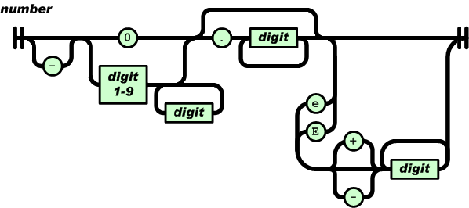

# 从零开始的 JSON 库教程（二）：解析数字

* Milo Yip
* 2016/9/18

本文是[《从零开始的 JSON 库教程》](https://zhuanlan.zhihu.com/json-tutorial)的第二个单元。本单元的源代码位于 [json-tutorial/tutorial02](https://github.com/miloyip/json-tutorial/blob/master/tutorial02/)。

本单元内容：

1. [初探重构](#1-初探重构)
2. [JSON 数字语法](#2-json-数字语法)
3. [数字表示方式](#3-数字表示方式)
4. [单元测试](#4-单元测试)
5. [十进制转换至二进制](#5-十进制转换至二进制)
6. [总结与练习](#6-总结与练习)
7. [参考](#7-参考)
8. [常见问题](#8-常见问题)

## 1. 初探重构

在讨论解析数字之前，我们再补充 TDD 中的一个步骤──重构（refactoring）。根据[1]，重构是一个这样的过程：

> 在不改变代码外在行为的情况下，对代码作出修改，以改进程序的内部结构。

在 TDD 的过程中，我们的目标是编写代码去通过测试。但由于这个目标的引导性太强，我们可能会忽略正确性以外的软件品质。在通过测试之后，代码的正确性得以保证，我们就应该审视现时的代码，看看有没有地方可以改进，而同时能维持测试顺利通过。我们可以安心地做各种修改，因为我们有单元测试，可以判断代码在修改后是否影响原来的行为。

那么，哪里要作出修改？Beck 和 Fowler（[1] 第 3 章）认为程序员要培养一种判断能力，找出程序中的坏味道。例如，在第一单元的练习中，可能大部分人都会复制 `lept_parse_null()` 的代码，作一些修改，成为 `lept_parse_true()` 和 `lept_parse_false()`。如果我们再审视这 3 个函数，它们非常相似。这违反编程中常说的 DRY（don't repeat yourself）原则。本单元的第一个练习题，就是尝试合并这 3 个函数。

另外，我们也可能发现，单元测试代码也有很重复的代码，例如 `test_parse_invalid_value()` 中我们每次测试一个不合法的 JSON 值，都有 4 行相似的代码。我们可以把它用宏的方式把它们简化：

~~~c
#define TEST_ERROR(error, json)\
    do {\
        lept_value v;\
        v.type = LEPT_FALSE;\
        EXPECT_EQ_INT(error, lept_parse(&v, json));\
        EXPECT_EQ_INT(LEPT_NULL, lept_get_type(&v));\
    } while(0)

static void test_parse_expect_value() {
    TEST_ERROR(LEPT_PARSE_EXPECT_VALUE, "");
    TEST_ERROR(LEPT_PARSE_EXPECT_VALUE, " ");
}
~~~

最后，我希望指出，软件的架构难以用单一标准评分，重构时要考虑平衡各种软件品质。例如上述把 3 个函数合并后，优点是减少重复的代码，维护较容易，但缺点可能是带来性能的少量影响。

## 2. JSON 数字语法

回归正题，本单元的重点在于解析 JSON number 类型。我们先看看它的语法：

~~~
number = [ "-" ] int [ frac ] [ exp ]
int = "0" / digit1-9 *digit
frac = "." 1*digit
exp = ("e" / "E") ["-" / "+"] 1*digit
~~~

number 是以十进制表示，它主要由 4 部分顺序组成：负号、整数、小数、指数。只有整数是必需部分。注意和直觉可能不同的是，正号是不合法的。

整数部分如果是 0 开始，只能是单个 0；而由 1-9 开始的话，可以加任意数量的数字（0-9）。也就是说，`0123` 不是一个合法的 JSON 数字。

小数部分比较直观，就是小数点后是一或多个数字（0-9）。

JSON 可使用科学记数法，指数部分由大写 E 或小写 e 开始，然后可有正负号，之后是一或多个数字（0-9）。

JSON 标准 [ECMA-404](https://www.ecma-international.org/publications/files/ECMA-ST/ECMA-404.pdf) 采用图的形式表示语法，也可以更直观地看到解析时可能经过的路径：

上一单元的 null、false、true 在解析后，我们只需把它们存储为类型。但对于数字，我们要考虑怎么存储解析后的结果。

## 3. 数字表示方式

从 JSON 数字的语法，我们可能直观地会认为它应该表示为一个浮点数（floating point number），因为它带有小数和指数部分。然而，标准中并没有限制数字的范围或精度。为简单起见，leptjson 选择以双精度浮点数（C 中的 `double` 类型）来存储 JSON 数字。

我们为 `lept_value` 添加成员：

~~~c
typedef struct {
    double n;
    lept_type type;
}lept_value;
~~~

仅当 `type == LEPT_NUMBER` 时，`n` 才表示 JSON 数字的数值。所以获取该值的 API 是这么实现的：

~~~c
double lept_get_number(const lept_value* v) {
    assert(v != NULL && v->type == LEPT_NUMBER);
    return v->n;
}
~~~

使用者应确保类型正确，才调用此 API。我们继续使用断言来保证。

## 4. 单元测试

我们定义了 API 之后，按照 TDD，我们可以先写一些单元测试。这次我们使用多行的宏的减少重复代码：

~~~c
#define TEST_NUMBER(expect, json)\
    do {\
        lept_value v;\
        EXPECT_EQ_INT(LEPT_PARSE_OK, lept_parse(&v, json));\
        EXPECT_EQ_INT(LEPT_NUMBER, lept_get_type(&v));\
        EXPECT_EQ_DOUBLE(expect, lept_get_number(&v));\
    } while(0)

static void test_parse_number() {
    TEST_NUMBER(0.0, "0");
    TEST_NUMBER(0.0, "-0");
    TEST_NUMBER(0.0, "-0.0");
    TEST_NUMBER(1.0, "1");
    TEST_NUMBER(-1.0, "-1");
    TEST_NUMBER(1.5, "1.5");
    TEST_NUMBER(-1.5, "-1.5");
    TEST_NUMBER(3.1416, "3.1416");
    TEST_NUMBER(1E10, "1E10");
    TEST_NUMBER(1e10, "1e10");
    TEST_NUMBER(1E+10, "1E+10");
    TEST_NUMBER(1E-10, "1E-10");
    TEST_NUMBER(-1E10, "-1E10");
    TEST_NUMBER(-1e10, "-1e10");
    TEST_NUMBER(-1E+10, "-1E+10");
    TEST_NUMBER(-1E-10, "-1E-10");
    TEST_NUMBER(1.234E+10, "1.234E+10");
    TEST_NUMBER(1.234E-10, "1.234E-10");
    TEST_NUMBER(0.0, "1e-10000"); /* must underflow */
}
~~~

以上这些都是很基本的测试用例，也可供调试用。大部分情况下，测试案例不能穷举所有可能性。因此，除了加入一些典型的用例，我们也常会使用一些边界值，例如最大值等。练习中会让同学找一些边界值作为用例。

除了这些合法的 JSON，我们也要写一些不合语法的用例：

~~~c
static void test_parse_invalid_value() {
    /* ... */
    /* invalid number */
    TEST_ERROR(LEPT_PARSE_INVALID_VALUE, "+0");
    TEST_ERROR(LEPT_PARSE_INVALID_VALUE, "+1");
    TEST_ERROR(LEPT_PARSE_INVALID_VALUE, ".123"); /* at least one digit before '.' */
    TEST_ERROR(LEPT_PARSE_INVALID_VALUE, "1.");   /* at least one digit after '.' */
    TEST_ERROR(LEPT_PARSE_INVALID_VALUE, "INF");
    TEST_ERROR(LEPT_PARSE_INVALID_VALUE, "inf");
    TEST_ERROR(LEPT_PARSE_INVALID_VALUE, "NAN");
    TEST_ERROR(LEPT_PARSE_INVALID_VALUE, "nan");
}
~~~

## 5. 十进制转换至二进制

我们需要把十进制的数字转换成二进制的 `double`。这并不是容易的事情 [2]。为了简单起见，leptjson 将使用标准库的 [`strtod()`](https://en.cppreference.com/w/c/string/byte/strtof) 来进行转换。`strtod()` 可转换 JSON 所要求的格式，但问题是，一些 JSON 不容许的格式，`strtod()` 也可转换，所以我们需要自行做格式校验。

~~~c
#include <stdlib.h>  /* NULL, strtod() */

static int lept_parse_number(lept_context* c, lept_value* v) {
    char* end;
    /* \TODO validate number */
    v->n = strtod(c->json, &end);
    if (c->json == end)
        return LEPT_PARSE_INVALID_VALUE;
    c->json = end;
    v->type = LEPT_NUMBER;
    return LEPT_PARSE_OK;
}
~~~

加入了 number 后，value 的语法变成：

~~~
value = null / false / true / number
~~~

记得在第一单元中，我们说可以用一个字符就能得知 value 是什么类型，有 11 个字符可判断 number：

* 0-9/- ➔ number

但是，由于我们在 `lept_parse_number()` 内部将会校验输入是否正确的值，我们可以简单地把余下的情况都交给 `lept_parse_number()`：

~~~c
static int lept_parse_value(lept_context* c, lept_value* v) {
    switch (*c->json) {
        case 't':  return lept_parse_true(c, v);
        case 'f':  return lept_parse_false(c, v);
        case 'n':  return lept_parse_null(c, v);
        default:   return lept_parse_number(c, v);
        case '\0': return LEPT_PARSE_EXPECT_VALUE;
    }
}
~~~

## 6. 总结与练习

本单元讲述了 JSON 数字类型的语法，以及 leptjson 所采用的自行校验＋`strtod()`转换为 `double` 的方案。实际上一些 JSON 库会采用更复杂的方案，例如支持 64 位带符号／无符号整数，自行实现转换。以我的个人经验，解析／生成数字类型可以说是 RapidJSON 中最难实现的部分，也是 RapidJSON 高效性能的原因，有机会再另外撰文解释。

此外我们谈及，重构与单元测试是互相依赖的软件开发技术，适当地运用可提升软件的品质。之后的单元还会有相关的话题。

1. 重构合并 `lept_parse_null()`、`lept_parse_false()`、`lept_parse_true` 为 `lept_parse_literal()`。
2. 加入 [维基百科双精度浮点数](https://en.wikipedia.org/wiki/Double-precision_floating-point_format#Double-precision_examples) 的一些边界值至单元测试，如 min subnormal positive double、max double 等。
3. 去掉 `test_parse_invalid_value()` 和 `test_parse_root_not_singular` 中的 `#if 0 ... #endif`，执行测试，证实测试失败。按 JSON number 的语法在 lept_parse_number() 校验，不符合标准的程况返回 `LEPT_PARSE_INVALID_VALUE` 错误码。
4. 去掉 `test_parse_number_too_big` 中的 `#if 0 ... #endif`，执行测试，证实测试失败。仔细阅读 [`strtod()`](https://en.cppreference.com/w/c/string/byte/strtof)，看看怎样从返回值得知数值是否过大，以返回 `LEPT_PARSE_NUMBER_TOO_BIG` 错误码。（提示：这里需要 `#include` 额外两个标准库头文件。）

以上最重要的是第 3 条题目，就是要校验 JSON 的数字语法。建议可使用以下两个宏去简化一下代码：

~~~c
#define ISDIGIT(ch)         ((ch) >= '0' && (ch) <= '9')
#define ISDIGIT1TO9(ch)     ((ch) >= '1' && (ch) <= '9')
~~~

另一提示，在校验成功以后，我们不再使用 `end` 指针去检测 `strtod()` 的正确性，第二个参数可传入 `NULL`。

如果你遇到问题，有不理解的地方，或是有建议，都欢迎在评论或 [issue](https://github.com/miloyip/json-tutorial/issues) 中提出，让所有人一起讨论。

## 7. 参考

[1] Fowler, Martin. Refactoring: improving the design of existing code. Pearson Education India, 2009. 中译本：《重构：改善既有代码的设计》，熊节译，人民邮电出版社，2010年。

[2] Gay, David M. "Correctly rounded binary-decimal and decimal-binary conversions." Numerical Analysis Manuscript 90-10 (1990).

## 8. 常见问题

1. 为什么要把一些测试代码以 `#if 0 ... #endif` 禁用？

   因为在做第 1 个练习题时，我希望能 100% 通过测试，方便做重构。另外，使用 `#if 0 ... #endif` 而不使用 `/* ... */`，是因为 C 的注释不支持嵌套（nested），而 `#if ... #endif` 是支持嵌套的。代码中已有注释时，用 `#if 0 ... #endif` 去禁用代码是一个常用技巧，而且可以把 `0` 改为 `1` 去恢复。

2. 科学计数法的指数部分没有对前导零作限制吗？`1E012` 也是合法的吗？

   是的，这是合法的。JSON 源自于 JavaScript（[ECMA-262, 3rd edition](https://www.ecma-international.org/publications/files/ECMA-ST-ARCH/ECMA-262,%203rd%20edition,%20December%201999.pdf)），数字语法取自 JavaScript 的十进位数字的语法（§7.8.3 Numeric Literals）。整数不容许前导零（leading zero），是因为更久的 JavaScript 版本容许以前导零来表示八进位数字，如 `052 == 42`，这种八进位常数表示方式来自于 [C 语言](https://en.cppreference.com/w/c/language/integer_constant)。禁止前导零避免了可能出现的歧义。但是在指数里就不会出现这个问题。多谢 @Smallay 提出及协助解答这个问题。

其他常见问答将会从评论中整理。
