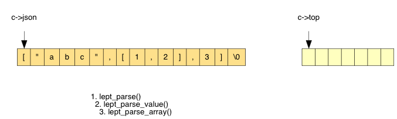
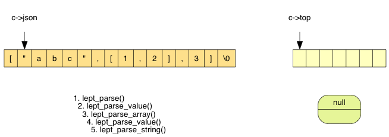
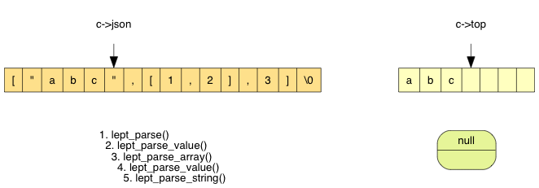
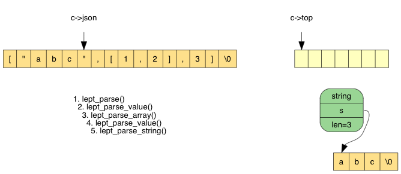
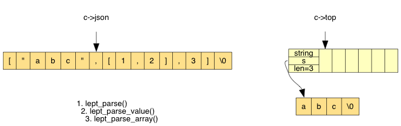
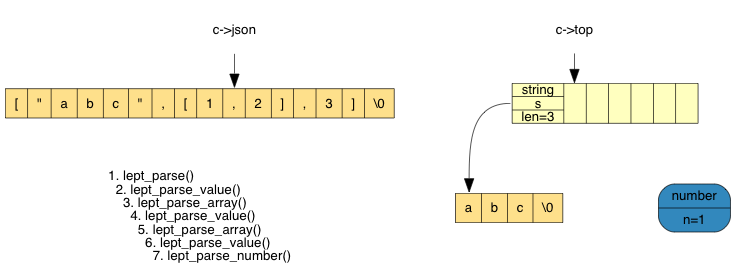
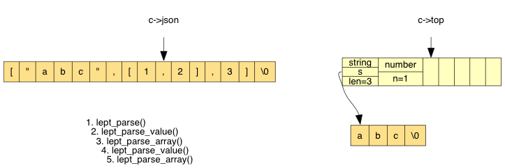
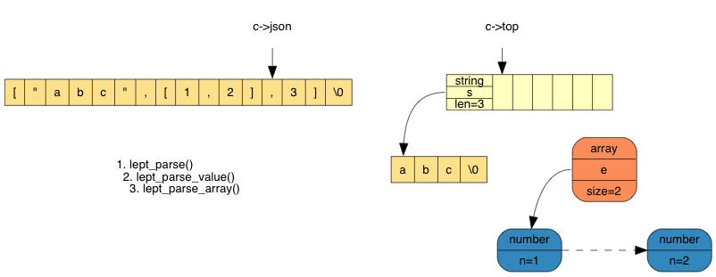
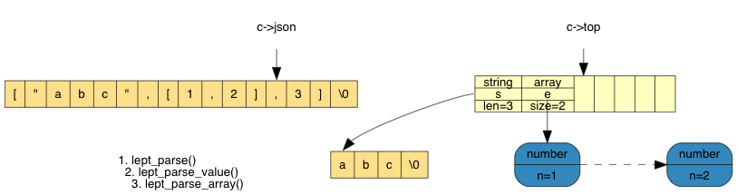
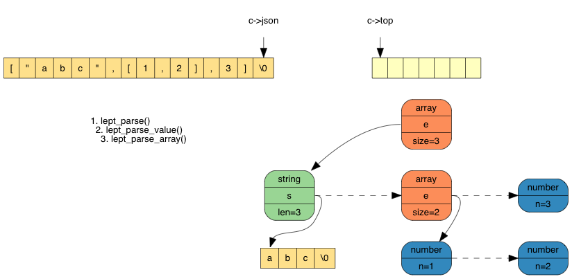

# 从零开始的 JSON 库教程（五）：解析数组

* Milo Yip
* 2016/10/7

本文是[《从零开始的 JSON 库教程》](https://zhuanlan.zhihu.com/json-tutorial)的第五个单元。代码位于 [json-tutorial/tutorial05](https://github.com/miloyip/json-tutorial/blob/master/tutorial05)。

本单元内容：

1. [JSON 数组](#1-json-数组)
2. [数据结构](#2-数据结构)
3. [解析过程](#3-解析过程)
4. [实现](#4-实现)
5. [总结与练习](#5-总结与练习)

## 1. JSON 数组

从零到这第五单元，我们终于要解析一个 JSON 的复合数据类型了。一个 JSON 数组可以包含零至多个元素，而这些元素也可以是数组类型。换句话说，我们可以表示嵌套（nested）的数据结构。先来看看 JSON 数组的语法：

~~~
array = %x5B ws [ value *( ws %x2C ws value ) ] ws %x5D
~~~

当中，`%x5B` 是左中括号 `[`，`%x2C` 是逗号 `,`，`%x5D` 是右中括号 `]` ，`ws` 是空白字符。一个数组可以包含零至多个值，以逗号分隔，例如 `[]`、`[1,2,true]`、`[[1,2],[3,4],"abc"]` 都是合法的数组。但注意 JSON 不接受末端额外的逗号，例如 `[1,2,]` 是不合法的（许多编程语言如 C/C++、Javascript、Java、C# 都容许数组初始值包含末端逗号）。

JSON 数组的语法很简单，实现的难点不在语法上，而是怎样管理内存。

## 2. 数据结构

首先，我们需要设计存储 JSON 数组类型的数据结构。

JSON 数组存储零至多个元素，最简单就是使用 C 语言的数组。数组最大的好处是能以 $O(1)$ 用索引访问任意元素，次要好处是内存布局紧凑，省内存之余还有高缓存一致性（cache coherence）。但数组的缺点是不能快速插入元素，而且我们在解析 JSON 数组的时候，还不知道应该分配多大的数组才合适。

另一个选择是链表（linked list），它的最大优点是可快速地插入元素（开端、末端或中间），但需要以 $O(n)$ 时间去经索引取得内容。如果我们只需顺序遍历，那么是没有问题的。还有一个小缺点，就是相对数组而言，链表在存储每个元素时有额外内存开销（存储下一节点的指针），而且片历时元素所在的内存可能不连续，令缓存不命中（cache miss）的机会上升。

我见过一些 JSON 库选择了链表，而这里则选择了数组。我们将会通过之前在解析字符串时实现的堆栈，来解决解析 JSON 数组时未知数组大小的问题。

决定之后，我们在 `lept_value` 的 `union` 中加入数组的结构：

~~~c
typedef struct lept_value lept_value;

struct lept_value {
    union {
        struct { lept_value* e; size_t size; }a; /* array */
        struct { char* s; size_t len; }s;
        double n;
    }u;
    lept_type type;
};
~~~

由于 `lept_value` 内使用了自身类型的指针，我们必须前向声明（forward declare）此类型。

另外，注意这里 `size` 是元素的个数，不是字节单位。我们增加两个 API 去访问 JSON 数组类型的值：

~~~c
size_t lept_get_array_size(const lept_value* v) {
    assert(v != NULL && v->type == LEPT_ARRAY);
    return v->u.a.size;
}

lept_value* lept_get_array_element(const lept_value* v, size_t index) {
    assert(v != NULL && v->type == LEPT_ARRAY);
    assert(index < v->u.a.size);
    return &v->u.a.e[index];
}
~~~

暂时我们不考虑增删数组元素，这些功能留待第八单元讨论。

然后，我们写一个单元测试去试用这些 API（练习需要更多测试）。

~~~c
#if defined(_MSC_VER)
#define EXPECT_EQ_SIZE_T(expect, actual) EXPECT_EQ_BASE((expect) == (actual), (size_t)expect, (size_t)actual, "%Iu")
#else
#define EXPECT_EQ_SIZE_T(expect, actual) EXPECT_EQ_BASE((expect) == (actual), (size_t)expect, (size_t)actual, "%zu")
#endif

static void test_parse_array() {
    lept_value v;

    lept_init(&v);
    EXPECT_EQ_INT(LEPT_PARSE_OK, lept_parse(&v, "[ ]"));
    EXPECT_EQ_INT(LEPT_ARRAY, lept_get_type(&v));
    EXPECT_EQ_SIZE_T(0, lept_get_array_size(&v));
    lept_free(&v);
}
~~~

在之前的单元中，作者已多次重申，C 语言的数组大小应该使用 `size_t` 类型。因为我们要验证 `lept_get_array_size()` 返回值是否正确，所以再为单元测试框架添加一个宏 `EXPECT_EQ_SIZE_T`。麻烦之处在于，ANSI C（C99）并没有的 `size_t` 打印方法，在 C99 则加入了 `"%zu"`，但 VS2015 中才有，之前的 VC 版本使用非标准的 `"%Iu"`。因此，上面的代码使用条件编译去区分 VC 和其他编译器。虽然这部分不跨平台也不是 ANSI C 标准，但它只在测试程序中，不太影响程序库的跨平台性。

## 3. 解析过程

我们在解析 JSON 字符串时，因为在开始时不能知道字符串的长度，而又需要进行转义，所以需要一个临时缓冲区去存储解析后的结果。我们为此实现了一个动态增长的堆栈，可以不断压入字符，最后一次性把整个字符串弹出，复制至新分配的内存之中。

对于 JSON 数组，我们也可以用相同的方法，而且，我们可以用同一个堆栈！我们只需要把每个解析好的元素压入堆栈，解析到数组结束时，再一次性把所有元素弹出，复制至新分配的内存之中。

但和字符串有点不一样，如果把 JSON 当作一棵树的数据结构，JSON 字符串是叶节点，而 JSON 数组是中间节点。在叶节点的解析函数中，我们怎样使用那个堆栈也可以，只要最后还原就好了。但对于数组这样的中间节点，共用这个堆栈没问题么？

答案是：只要在解析函数结束时还原堆栈的状态，就没有问题。为了直观地了解这个解析过程，我们用连环图去展示 `["abc",[1,2],3]` 的解析过程。

首先，我们遇到 `[`，进入 `lept_parse_array()`：

生成一个临时的 `lept_value`，用于存储之后的元素。我们再调用 `lept_parse_value()` 去解析这个元素值，因为遇到 `"` 进入 `lept_parse_string()`：

在 `lept_parse_string()` 中，不断解析字符直至遇到 `"`，过程中把每个字符压栈：

最后在 `lept_parse_string()` 中，把栈上 3 个字符弹出，分配内存，生成字符串值：

返回上一层 `lept_parse_array()`，把临时元素压栈：

然后我们再遇到 `[`，进入另一个 `lept_parse_array()`。它发现第一个元素是数字类型，所认调用 `lept_parse_number()`，生成一个临时的元素值：

之后把该临时的元素值压栈：

接着再解析第二个元素。我们遇到了 `]`，从栈上弹出 2 个元素，分配内存，生成数组（虚线代表是连续的内存）：

那个数组是上层数组的元素，我们把它压栈。现时栈内已有两个元素，我们再继续解析下一个元素：

最后，遇到了 `]`，可以弹出栈内 3 个元素，分配内存，生成数组：

## 4. 实现

经过这个详细的图解，实现 `lept_parse_array()` 应该没有难度。以下是半制成品：

~~~c
static int lept_parse_value(lept_context* c, lept_value* v); /* 前向声明 */

static int lept_parse_array(lept_context* c, lept_value* v) {
    size_t size = 0;
    int ret;
    EXPECT(c, '[');
    if (*c->json == ']') {
        c->json++;
        v->type = LEPT_ARRAY;
        v->u.a.size = 0;
        v->u.a.e = NULL;
        return LEPT_PARSE_OK;
    }
    for (;;) {
        lept_value e;
        lept_init(&e);
        if ((ret = lept_parse_value(c, &e)) != LEPT_PARSE_OK)
            return ret;
        memcpy(lept_context_push(c, sizeof(lept_value)), &e, sizeof(lept_value));
        size++;
        if (*c->json == ',')
            c->json++;
        else if (*c->json == ']') {
            c->json++;
            v->type = LEPT_ARRAY;
            v->u.a.size = size;
            size *= sizeof(lept_value);
            memcpy(v->u.a.e = (lept_value*)malloc(size), lept_context_pop(c, size), size);
            return LEPT_PARSE_OK;
        }
        else
            return LEPT_PARSE_MISS_COMMA_OR_SQUARE_BRACKET;
    }
}

static int lept_parse_value(lept_context* c, lept_value* v) {
    switch (*c->json) {
        /* ... */
        case '[':  return lept_parse_array(c, v);
    }
}
~~~

简单说明的话，就是在循环中建立一个临时值（`lept_value e`），然后调用 `lept_parse_value()` 去把元素解析至这个临时值，完成后把临时值压栈。当遇到 `]`，把栈内的元素弹出，分配内存，生成数组值。

注意到，`lept_parse_value()` 会调用 `lept_parse_array()`，而 `lept_parse_array()` 又会调用 `lept_parse_value()`，这是互相引用，所以必须要加入函数前向声明。

最后，我想告诉同学，实现这个函数时，我曾经制造一个不明显的 bug。这个函数有两个 `memcpy()`，第一个「似乎」是可以避免的，先压栈取得元素的指针，给 `lept_parse_value`：

~~~c
    for (;;) {
        /* bug! */
        lept_value* e = lept_context_push(c, sizeof(lept_value));
        lept_init(e);
        size++;
        if ((ret = lept_parse_value(c, e)) != LEPT_PARSE_OK)
            return ret;
        /* ... */
    }
~~~

这种写法为什么会有 bug？这是第 5 条练习题。

## 5. 总结与练习

1. 编写 `test_parse_array()` 单元测试，解析以下 2 个 JSON。由于数组是复合的类型，不能使用一个宏去测试结果，请使用各个 API 检查解析后的内容。

~~~js
[ null , false , true , 123 , "abc" ]
[ [ ] , [ 0 ] , [ 0 , 1 ] , [ 0 , 1 , 2 ] ]
~~~

2. 现时的测试结果应该是失败的，因为 `lept_parse_array()` 里没有处理空白字符，加进合适的 `lept_parse_whitespace()` 令测试通过。

3. 使用[第三单元解答篇](../tutorial03_answer/tutorial03_answer.md)介绍的检测内存泄漏工具，会发现测试中有内存泄漏。很明显在 `lept_parse_array()` 中使用到 `malloc()` 分配内存，但却没有对应的 `free()`。应该在哪里释放内存？修改代码，使工具不再检测到相关的内存泄漏。

4. 开启 test.c 中两处被 `#if 0 ... #endif` 关闭的测试，本来 `test_parse_array()` 已经能处理这些测试。然而，运行时会发现 `Assertion failed: (c.top == 0)` 断言失败。这是由于，当错误发生时，仍然有一些临时值在堆栈里，既没有放进数组，也没有被释放。修改 `test_parse_array()`，当遇到错误时，从堆栈中弹出并释放那些临时值，然后才返回错误码。

5. 第 4 节那段代码为什么会有 bug？

如果你遇到问题，有不理解的地方，或是有建议，都欢迎在评论或 [issue](https://github.com/miloyip/json-tutorial/issues) 中提出，让所有人一起讨论。
